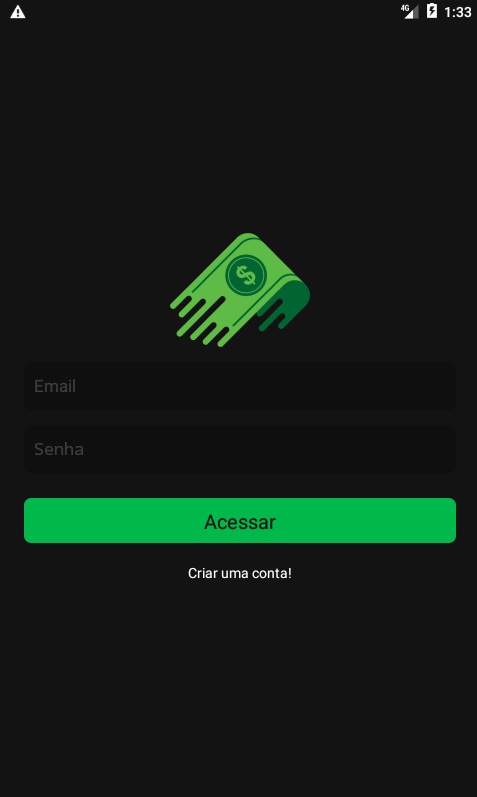
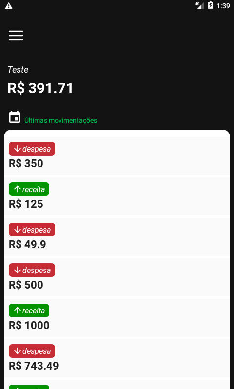
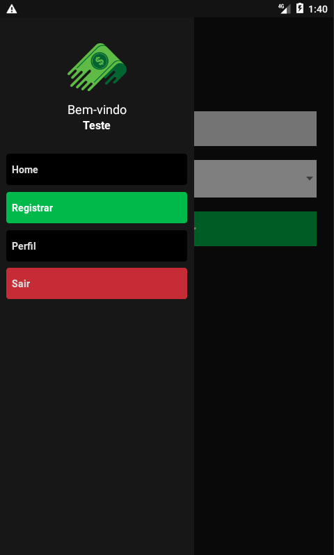

# Finances

## Descrição

Um aplicativo para controle financeiro. Com o Finances é possível cadastrar despesas e receitas, assim tendo um maior controle dos gastos.

## Tecnologias

As seguintes ferramentas foram usadas na construção do projeto:

- [React Native](https://reactnative.dev/)
- [React Navigation](https://reactnavigation.org/)
- [react-native-vector-icons](https://github.com/oblador/react-native-vector-icons)
- [react-native-async-storage/async-storage](https://github.com/react-native-async-storage/async-storage)
- [react-native-community/datetimepicker](https://github.com/react-native-datetimepicker/datetimepicker)
- [react-native-picker/picker](https://github.com/react-native-picker/picker)
- [react-native-dotenv](https://www.npmjs.com/package/react-native-dotenv)
- [styled-components](https://styled-components.com/)
- [date-fns](https://date-fns.org/)
- [Firebase](https://firebase.google.com/)

## Rodando o Projeto

Para clonar e executar esta aplicação, você precisará de [Git](https://git-scm.com/) e [Node.js](https://nodejs.org/en/) + [Yarn v1.13](https://yarnpkg.com/) instalados na sua máquina. Você também precisará criar um app na sua conta do [Firebase](https://firebase.google.com/). Após clonar este repositório, renomeie o arquivo .env.example para .env e insira as suas credenciais do firebase. Da sua linha de comando execute:

```bash
# Clone este repositório
$ git clone https://github.com/lucas-salles/financesrn.git

# Acesse a pasta do projeto
$ cd financesrn

# Instale as dependências
$ yarn install

# Execute o app (IOS)
$ yarn ios --simulator="iPhone XS Max"

# Execute o app (Android)
$ yarn android
```



